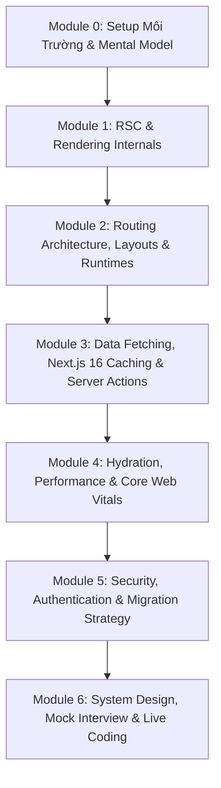

# ⚡ Next.js 16 & React 19.2 Interview Mastery (Middle / Senior Level)

[](https://nextjs.org/)
[](https://react.dev/)
[-blueviolet)](https://turbo.build/pack)
[](https://www.typescriptlang.org/)
[](https://tailwindcss.com/)

Hệ thống tài liệu chuyên sâu, phân tích bản chất kiến trúc (*Why & Trade-offs*), bộ câu hỏi phỏng vấn thực chiến và sân tập sandbox dành cho kỹ sư **Middle / Senior / Lead Next.js & Frontend Engineer**.

---

## 🎯 Mục Tiêu Khóa Học
- **Làm chủ bản chất:** Hiểu sâu cách thức hoạt động bên dưới của Next.js 16 và React 19.2 (RSC wire-format, mô hình Cache Components `"use cache"`, Async Request APIs, `proxy.ts`, Streaming SSR, Selective Hydration).
- **Tư duy Senior / Architect:** Phân tích ưu/nhược điểm, đánh đổi hiệu năng (TTFB, INP, LCP) và chi phí hạ tầng khi đưa ra quyết định kỹ thuật.
- **Tự tin phỏng vấn:** Trả lời xuất sắc các câu hỏi bẫy (trick questions), giải quyết bài toán System Design quy mô lớn (E-Commerce 50k req/s, Flash Sale) và vượt qua các bài thi Live Coding Refactoring trong 45 phút.

---

## 🚀 Điểm Nhấn Công Nghệ (Next.js 16 & React 19.2)

1. **Turbopack (Bundler Mặc Định)**: Tăng tốc Fast Refresh tới 10x, build production nhanh hơn 2–5x với cơ chế File System Caching.
2. **Cache Components & `"use cache"` Directive**: Mô hình caching linh hoạt ở cấp độ function & component, thay thế các giải pháp cũ và kích hoạt Instant Navigations.
3. **Bộ Đôi Invalidation API Chuẩn**:
   - `updateTag(tag)`: Read-your-own-writes (Strong Consistency) trong Server Actions.
   - `revalidateTag(tag, profile)`: Stale-While-Revalidate (Eventual Consistency) cho Background Tasks/Webhooks.
4. **`proxy.ts`**: Tái định nghĩa Network Boundary tại Edge/Server thay thế cho `middleware.ts`.
5. **Async Request APIs**: Chuẩn hóa `await cookies()`, `await headers()`, `await params`, `await searchParams` và `connection()`.
6. **`after()` API**: Tối ưu TTFB bằng cách đưa tác vụ phụ (logging, analytics) chạy ngầm sau khi response đã stream xong về client.
7. **React 19.2 Primitives**: React Compiler tự động memoization, `<Activity />` offscreen rendering, Actions API (`useActionState`, `useOptimistic`, `useFormStatus`).

---

## 🗺️ Lộ Trình 22 Bài Học (7 Modules)



### Module 0: Setup Môi Trường & Mental Model Kiến Trúc
- **Bài 00:** Dựng sân tập Next.js 16 & Sanity Check môi trường máy thật
- **Bài 01:** App Router vs Pages Router Architecture: Sự thay đổi Paradigm & Request Lifecycle trong Next.js 16

### Module 1: React Server Components & Next.js 16 Rendering Internals
- **Bài 02:** React Server Components (RSC) vs Client Components: Serialization, Boundaries & Bundle Impact
- **Bài 03:** Async Request APIs & Dynamic Rendering trong Next.js 16: `await cookies()`, `headers()`, `params` & `connection()`
- **Bài 04:** Streaming SSR & Suspense Architecture: Selective Hydration & Giải mã Bottleneck Waterfall
- **Bài 05:** Cache Components & `"use cache"` Directive: Tái Định Hình Hybrid Prerendering & Instant Navigations
- 📑 *Cheat-Sheet 01:* [reference/01-rendering-and-rsc-cheatsheet.html](reference/01-rendering-and-rsc-cheatsheet.html)

### Module 2: Routing Architecture, Layouts & Runtimes
- **Bài 06:** Layouts, Templates, Route Groups `(group)` & Lifecycle phân rã UI
- **Bài 07:** Parallel Routes (`@slot`, `default.js`) & Intercepting Routes (`(.)`, `(..)`): Pattern Modal URL-Shareable
- **Bài 08:** `proxy.ts` (Thay Thế `middleware.ts`), Route Handlers & Node.js vs Edge Runtime Tradeoffs

### Module 3: Data Fetching, Next.js 16 Caching & Server Actions
- **Bài 09:** Giải phẫu Caching Next.js 16: `updateTag()` (Strong Consistency) vs `revalidateTag(tag, profile)` (SWR)
- **Bài 10:** Server Actions & React 19 Actions API (`useActionState`, `useOptimistic`, `useFormStatus`)
- **Bài 11:** Chiến Lược Quản Lý State: URL SearchParams, Server State (RSC) vs Client Store (Zustand/Context)
- 📑 *Cheat-Sheet 02:* [reference/02-routing-caching-actions-cheatsheet.html](reference/02-routing-caching-actions-cheatsheet.html)

### Module 4: Hydration, Performance & Core Web Vitals
- **Bài 12:** Hydration Mismatch & Errors: Nguyên Nhân Gốc Rễ (Root Cause) & React 19.2 Hydration Diffing
- **Bài 13:** Next.js Built-in Optimizations: `next/image`, `next/font`, `next/script` & Turbopack Analyzer
- **Bài 14:** Core Web Vitals 2025/2026: Chiến Lược Tối Ưu INP (Interaction to Next Paint), LCP và CLS
- **Bài 15:** Background Tasks với `after()` API & React 19.2 `<Activity />` Offscreen Rendering

### Module 5: Security, Authentication & Architectural System Design
- **Bài 16:** Authentication & Authorization Patterns: Cookie-based Sessions & Auth.js v5 trên RSC Boundary
- **Bài 17:** Security Best Practices: CSRF, XSS, CSP, React Taint APIs & Quản Lý Secrets với `server-only`
- **Bài 18:** Migration Strategy: Kế Hoạch Nâng Cấp Lên Next.js 16 & `proxy.ts` Zero-Downtime
- 📑 *Cheat-Sheet 03:* [reference/03-performance-security-cheatsheet.html](reference/03-performance-security-cheatsheet.html)

### Module 6: System Design, Mock Interview & Live Coding Challenges
- **Bài 19:** System Design Scenario: Thiết Kế Hệ Thống E-Commerce / Dashboard Scale Lớn với Next.js 16
- **Bài 20:** Mock Interview Senior Part 1: Top 20 Câu Hỏi Phỏng Vấn Bẫy & Tình Huống Kịch Bản (Scenario-Based)
- **Bài 21:** Mock Interview Senior Part 2: Live Code Refactoring & Debugging Challenge (Codebase lỗi, refactor chuẩn Senior 45p)
- 📑 *Cheat-Sheet 04:* [reference/04-system-design-mock-interview-cheatsheet.html](reference/04-system-design-mock-interview-cheatsheet.html)

---

## 📂 Cấu Trúc Thư Mục Repository

```text
.
├── lessons/               # Toàn bộ bài học HTML tương tác (Dark Mode) + index.html
│   ├── index.html         # Trang mục lục lộ trình tổng quan
│   ├── 0000-setup-environment.html
│   ├── lesson.css         # Design system & tokens dùng chung
│   └── lesson-enhance.js  # Copy button, Quiz handler, Navigation UI
├── reference/             # 4 Cheat-Sheets tra cứu nhanh trước khi phỏng vấn
├── learning-records/      # Nhật ký học tập & bằng chứng thực hành từng bài
├── next-practice/         # Sân tập thực hành Next.js 16 (Turbopack, TypeScript, Tailwind)
│   ├── src/app/           # App Router source code thực hành
│   ├── next.config.ts     # Cấu hình Next.js 16
│   └── package.json
├── GLOSSARY.md            # Bảng thuật ngữ chuẩn hóa Next.js 16
├── MISSION.md             # Mục tiêu, phạm vi & tiêu chí thành công
├── NOTES.md               # Quy tắc Git & ghi chú người học
└── README.md              # Tài liệu giới thiệu tổng quan dự án
```

---

## ⚡ Hướng Dẫn Bắt Đầu Nhanh (Quick Start)

### 1. Xem Mục Lục Bài Học
Mở trực tiếp file `lessons/index.html` trên trình duyệt bất kỳ hoặc sử dụng Live Server:
```bash
# Xem bài học 00 trên trình duyệt
start lessons/0000-setup-environment.html
```

### 2. Khởi Động Sân Tập Thực Hành (`next-practice`)
```bash
cd next-practice

# Cài đặt dependencies (nếu chưa có)
npm install

# Chạy server development với Turbopack
npm run dev

# Kiểm tra build production
npm run build
```
Truy cập ứng dụng tại: `http://localhost:3000`.

### 3. Quy Chuẩn Git Khi Học
- **Quy tắc phân nhánh:** Trước khi học bài nào, checkout nhánh tương ứng bằng tiếng Anh:
  ```bash
  git checkout -b lesson-00  # Cho bài 00
  git checkout -b lesson-01  # Cho bài 01
  ```
- **Quy tắc commit:** Viết commit message bằng tiếng Anh theo chuẩn Conventional Commits:
  ```bash
  git commit -m "feat(lesson-01): complete app router architecture exercise"
  ```
